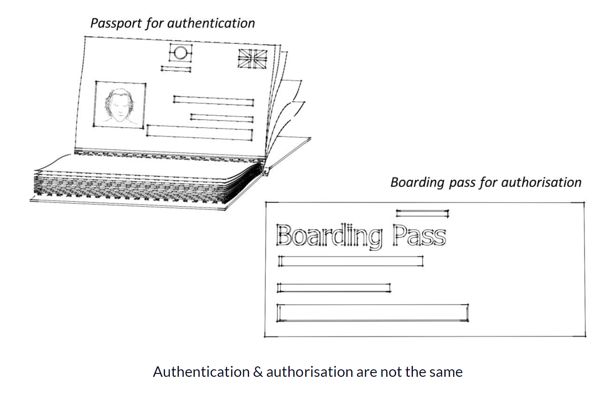
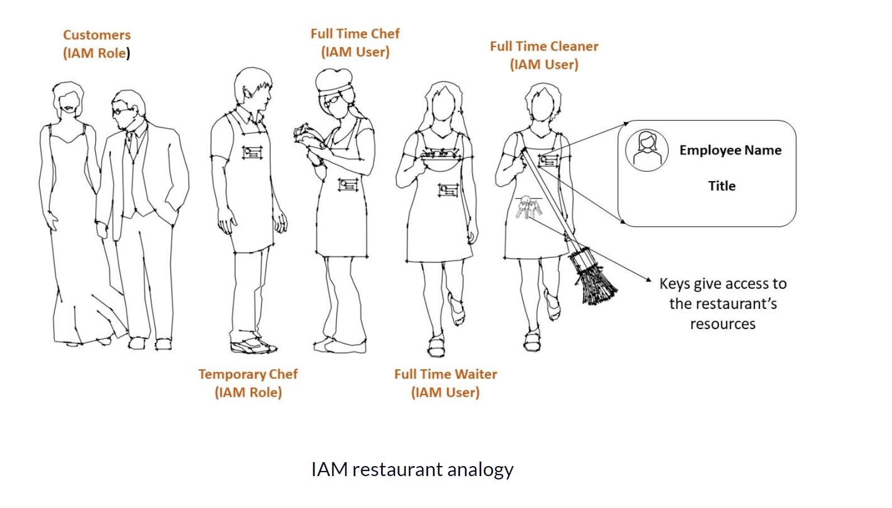
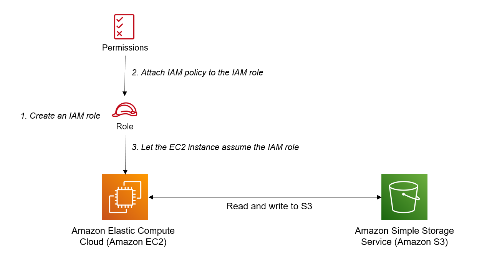

# AWS IAM : Identity and Access Management

**AWS IAM** gives you control over who can access your AWS services and resources based on some predefined permissions.

- The two keywords here are “who” and “permissions”.
  --> “Who” refers to a specific identity, which can be a user, group or role.
  --> “permissions” refer to the policies that are attached to an identity. These permissions either allow or deny access to a resource.
- IAM is the AWS way of authenticating and authorising identities. Authentication is not, however, the same as authorisation. Authentication is concerned with the “who” while authorisation is concerned with the “permissions”.

# Difference between Authentication and Authorization:

- Authentication is when an identity proves it is what/who it says it is.
- Authorisation, on the other hand, is proving that you have the permissions to access a resource.

# Analogy To understand Aithentication and Authorization:

- You need to be both authenticated and authorised in order to board a flight.
- Authentication is done with your passport or ID, where it is checked to ensure that the photo in your passport matches your face. This proves that you are who you say you are.
- After you have been authenticated, you need to prove that you have the permission to take a specific flight. This is done with your boarding pass.
- Both authentication and authorisation need to be carried out before you can board a flight. Similarly, both need to be carried out before you can access AWS resources.
  

- IAM users, groups, and roles are concerned with authentication – that is, proving that you are who you say you are. They are like passports that get you through security in an airport, Without a boarding pass however, you cannot board a plane.
- The IAM policy is like a boarding pass, in that it grants or denies access to specific resources.

# What are the IAM Users?

- This is any identity (humans or an application) that requires long term access to AWS resources.
- These entities make requests to IAM to get authenticated before any interaction with AWS resources is allowed the happen.
- Authentication is done using a username/password combination for humans accessing AWS through the console, or through access keys for an application or a human accessing AWS through the command line interface.

# What are the IAM Groups?

- IAM users can be placed in an IAM group.
- IAM groups makes it easier to organise a large number IAM users and apply permissions on a group level instead of an individual level. This is because the latter does not scale for a large number of users.
- Imagine you have a team that consists of developers, architects, admin staff, DevOps engineers, live support and testers. Each of these teams has 10 people, for a total of 60 people.
- Instead of setting permission policies for 60 people individually, you can put IAM users into their respective groups and apply permissions on a group level. This makes it easier to organise permissions and also easier to scale as your team grows.

**Note**: There are no login credentials for IAM groups. Also, a user can belong to multiple groups, so for example, an IAM user that is in the DevOps group can also be in the live support group. This maps neatly to the real world where a DevOps engineer can also be in live support.

# What are the IAM Roles?

- IAM roles are used to grant temporary access to multiple identities.
- These identities could be humans external to AWS accessing your services, IAM users, or applications.
- These identities assume the role temporarily, and any permission policies attached to the role are by proxy applied to the identity assuming that role.
- IAM roles are important because AWS has hard limits on the number of IAM users (currently 5000).
- IAM policies that are attached to roles come in two flavours – trust policy and permission policy.

# What are the IAM Policy?

- IAM Policies are attached to identities, so users, groups, or roles.
- IAM policies can also be attached to some AWS resources. These types of policies are called resource based policies.
- IAM policies are JSON documents, consisting of one or more statements that grant or deny access to AWS resources.
- The IAM policy below shows how permissions are granted to an identity to read and write from an S3 bucket.
  {
  "Version": "2012-10-17",
  "Statement": [
  {
  "Sid": "ListObjectsInBucket",
  "Effect": "Allow",
  "Action": ["s3:ListBucket"],
  "Resource": ["arn:aws:s3:::bucket-name"]
  },
  {
  "Sid": "AllObjectActions",
  "Effect": "Allow",
  "Action": "s3:_Object",
  "Resource": ["arn:aws:s3:::bucket-name/_"]
  }
  ]
  }
- Sid stands for statement ID, an optional field that lets the reader quickly identify what a statement does.
- Effect can be either allow or deny
- Action refers to what action are you trying to perform. Format is service:operation.
- Resource refers to which resource are you interacting with. Typically you'll use ARN (Amazon Resource Name) which uniquely identify AWS resources.
- By default, all requests are implicitly denied unless a policy explicitly has an “allow” as is the case in the example above.
- This principle of least privilege ensures that an identity cannot use a resource unless they are explicitly granted the permission to do so.

# How IAM Works:

- Consider a pizza restaurant.
- It will have some full time employees – like chefs, waiters and cleaners.
- It may also have some part time chefs to help during peak demand on evenings and weekends.
- If the restaurant is any good, it will also have customers who can eat in and take out.

- To draw an analogy with AWS IAM, the full time employees are like IAM users.
- They require long term access to the restaurant’s resources as shown above.
- These users will all belong to different groups – the waiters, chef, and cleaners group (that is, all waiters, for example, will have the same job title of “waiter”).
  

# How are the restaurant’s employees authenticated?

# How do we know that they are who they say they are?

- Name badges with a picture will do the job. This can also show their title which is analogous to the IAM group that they belong to.
- The permission policies that define what resources the restaurant’s employees can access are applied on the group level, since every waiter, chef and cleaner will have the same permissions. This may not be true in reality, as the head chef for example may have privileged access. But for simplicity, let's assume it is true.

# How does the restaurant manager control who has access to what resources?

- Doors with locks will do just fine. **Keys act as a policy** as they control access to parts of the restaurant.
- An identical set will be given to all waiters, since waiters will need the same level of access to the food/drink storage room, kitchen, and seating area.
- The same logic will apply to the other full time employees, where the appropriate set of keys are handed out so that they can use the restaurant’s resources as needed.
- Giving keys to the restaurant employees is analogous to attaching a policy to an IAM user or group. Without the keys, the employees cannot access parts of the restaurant.
- Similarly in AWS, **without policies** that explicitly allow an action, requests cannot be made to AWS resources. The default state in both AWS and our restaurant analogy is an implicit deny when trying to access resources.
- The part time employees, like a temporary chef for example, and the customers, don’t need long term access to resources but will need short term access, analogous to IAM roles.
- The part time employees can only work during a short window – say during evenings on the weekend. Outside of this time, they don’t have permissions to use the restaurant’s resources.
- This part time chef does not have to be the same person. It could be a different person every week, unlike the full time employees that have specific identities.
- A part time chef will therefore assume the role of a chef and get a temporary badge that they keep for the duration of their shift. This is analogous to an entity assuming an IAM role that has a policy attached to it and getting Temporary Security Credentials that will expire after some time.
- Again, the policy here is the set of keys that grant permission to parts of the restaurant while the Temporary Security Credential is the temporary badge used to authenticate the chef.

Similarly, the customers are analogous to IAM roles for two reasons. First, they only require temporary access to the restaurant. Second, and perhaps more importantly, a successful restaurant will have tens of thousands to hundreds of thousands of unique customers over its lifetime.
Having a large number of unidentified entities is a perfect use case for IAM roles.

--> Recall that with AWS, there is a hard limit of 5000 for the number of IAM users you can have.
--> If there is a use case where the number of IAM users required will exceed this 5000 limit, using IAM roles is your only option around this.
--> Just like how IAM roles are assumed, the customer first needs to order something to prove that they are a customer and can assume the role of a customer.
--> After the customer role is assumed, the permissions policy attached to the customer role is then applied to the customer as well. Customers have permissions to only use some resources like the seating area and the toilet.

To keep the analogy realistic, access to the toilet is controlled by entering a passcode which changes every day, thus ensuring that the access is temporary. This passcode is analogous to the policy attached to the customer role that grants temporary access to the toilet.

# UseCase for IAM:

- Consider the following very simple architecture: an EC2 instance running an application that needs full access to an S3 bucket.
  

  # Steps:

  1. Create an IAM role for your EC2 instance
  2. Attach an IAM policy to the role that gives full access to the S3 bucket
     {
     "Version": "2012-10-17",
     "Statement": [
     {
     "Effect": "Allow",
     "Action": [
     "s3:*",
     "s3-object-lambda:*"
     ],
     "Resource": "\*"
     }
     ]
     }
  3. Let the EC2 instance assume the role,You can now read from and write to the S3 bucket

  **Notice**: Notice that in the policy above, it doesn’t specify any ARN, but just says “\*” for the resource. This means all S3 buckets. If that is what you want, then this policy is fine. But if you want to specify a single bucket, then you need to give the bucket ARN.
